# Visual Designer Manager – brugermanual

Version **2.0.0-rc.9** · Trin-for-trin vejledning med skærmbilleder

Denne manual viser, hvordan man bygger og vedligeholder et website med Visual Designer Manager (VDM). Eksemplet er en veteranklub, "Nordisk Veteranklub", og hver del bygger videre på den forrige. Til sidst har du et website med forside, menu, header og footer, arrangementer, køretøjer, billedgalleri og kontaktformular. Det virker på både computer og mobil.

> Skærmbillederne er taget på en testinstallation af WordPress 6.8.3 med engelsk WordPress-sprog. Visual Designer Manager er på dansk. På et dansk WordPress hedder WordPress' egne menuer fx *Plugins → Aktivér* i stedet for *Plugins → Activate*.
>
> Røde rammer på billederne markerer det, teksten handler om.

## Indhold

1. [Installation og aktivering](#1-installation-og-aktivering)
2. [Siteindstillinger](#2-siteindstillinger)
3. [Tema (Site Design)](#3-tema-site-design)
4. [Opret en side](#4-opret-en-side)
5. [Visual Designer – grundlæggende](#5-visual-designer--grundlæggende)
6. [Tilpas siden til mobil](#6-tilpas-siden-til-mobil)
7. [Gem, forhåndsvis og versioner](#7-gem-forhåndsvis-og-versioner)
8. [Menu](#8-menu)
9. [Header og footer](#9-header-og-footer)
10. [Events, køretøjer og billedgalleri](#10-events-køretøjer-og-billedgalleri)
11. [Vis indholdet på en side](#11-vis-indholdet-på-en-side)
12. [Det færdige website](#12-det-færdige-website)
13. [Kontaktformularen](#13-kontaktformularen)
14. [Eksport, import og flytning af site](#14-eksport-import-og-flytning-af-site)
15. [Backup, opdateringer og log](#15-backup-opdateringer-og-log)
16. [Gode råd og fejlfinding](#16-gode-råd-og-fejlfinding)

---

## 1. Installation og aktivering

1. Hent ZIP-filen `visual-designer-manager-v2.0.0-rc.9.zip`.
2. Gå til **Plugins → Tilføj nyt → Upload plugin** i WordPress, vælg ZIP-filen og klik **Installér nu**.
3. Klik **Aktivér** ud for *Visual Designer Manager*.

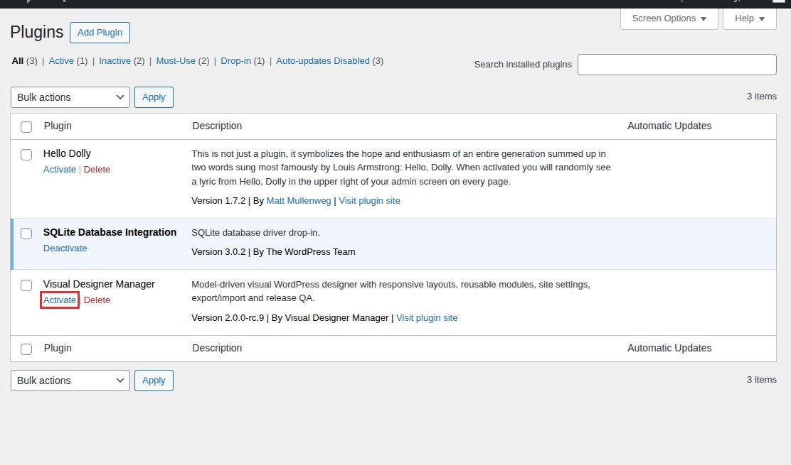

Menupunktet **Visual Designer Manager** vises nu i venstre side. Oversigten har genveje til de vigtigste funktioner og viser, hvilken version du kører.

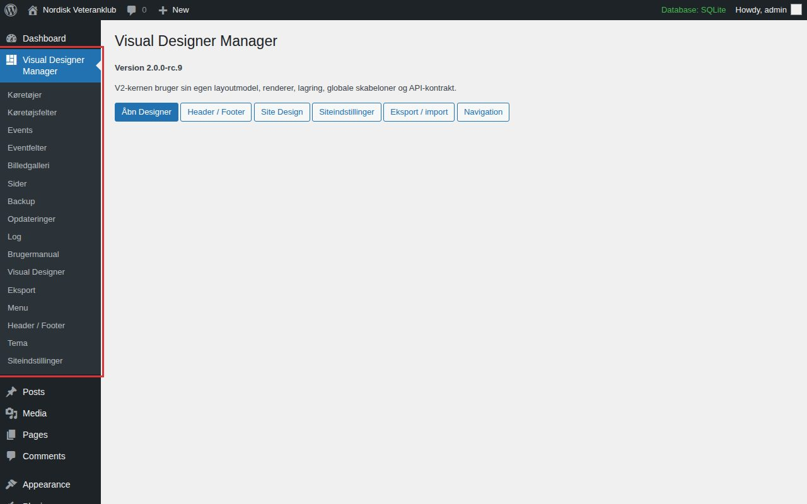

> Når pluginnet er installeret, kommer nye versioner automatisk via **Opdateringer** (se afsnit 15).

## 2. Siteindstillinger

Under **Visual Designer Manager → Siteindstillinger** udfylder du oplysninger om foreningen én gang, så de kan bruges hele sitet:

- **Webstedstitel** og **slogan**
- **Forening / organisation**
- **Kontakt-e-mail** – kontaktformularen sender til denne adresse
- **Telefon**
- **Logo** og **site-ikon**: klik **Vælg billede** og vælg et billede i mediebiblioteket.

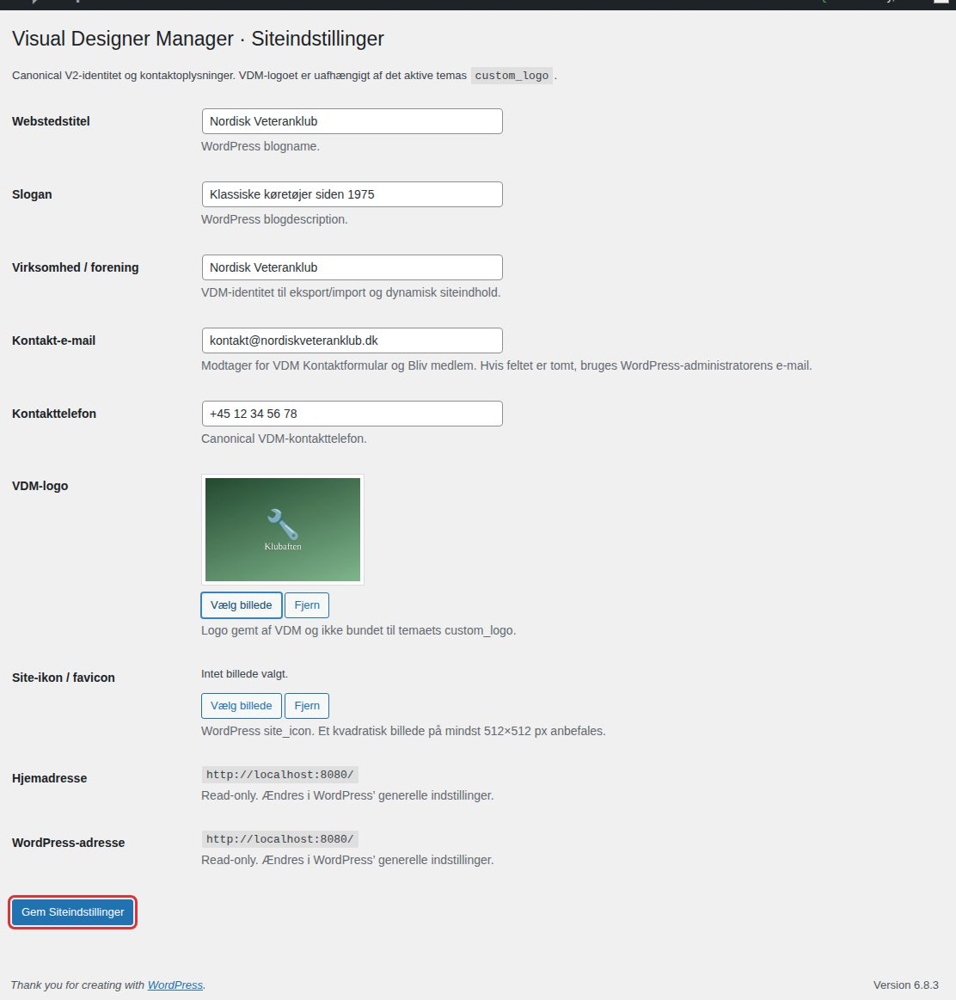

Mediebiblioteket åbner i et vindue. Vælg fanen **Media Library** (Mediebibliotek), klik på billedet og derefter **Brug billede**.

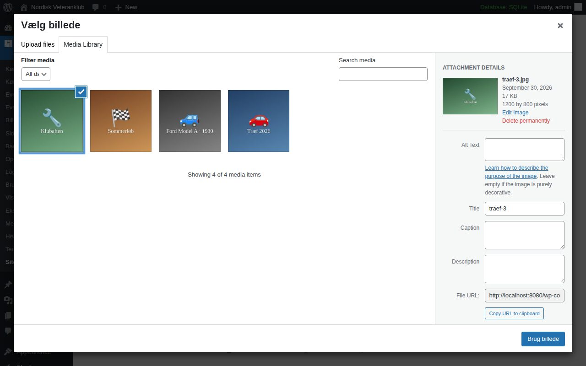

Klik **Gem Siteindstillinger**.

## 3. Tema (Site Design)

Under **Tema** vælger du det globale udseende: sidebredde, sidepadding, farver og skrifttype.

**Vigtigt:** Sæt flueben ved **Aktiv** under *VDM site-shell*. Så bruger websitet VDM's egen header, footer og sidebredde i stedet for WordPress-temaets. Uden flueben vises dine sider inde i temaets layout med temaets header og footer.

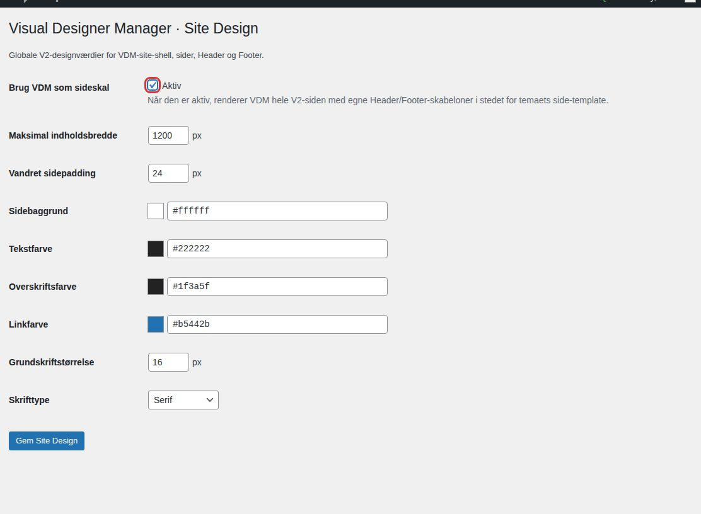

Klik **Gem Site Design**.

## 4. Opret en side

1. Gå til **Sider**.
2. Skriv en **Titel**, fx *Forside*. Slug og overordnet side er valgfri.
3. Vælg **Status**: *Kladde* (kun synlig for dig) eller *Publiceret* (synlig for alle).
4. Klik **Opret og åbn Visual Designer**.

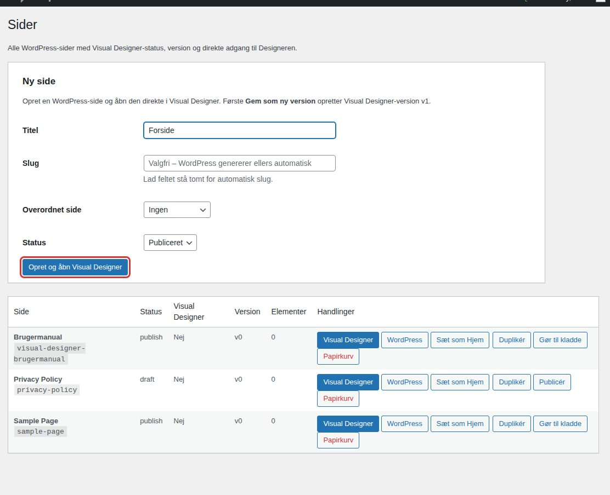

Listen nederst på siden **Sider** viser alle sider med VDM-version og antal elementer. Her kan du også:

- **Sæt som Hjem** – gør siden til websitets forside. Det er den side, man ser på `www.ditdomæne.dk`.
- **Duplikér**, **Gør til kladde / Publicér** og **Papirkurv**.

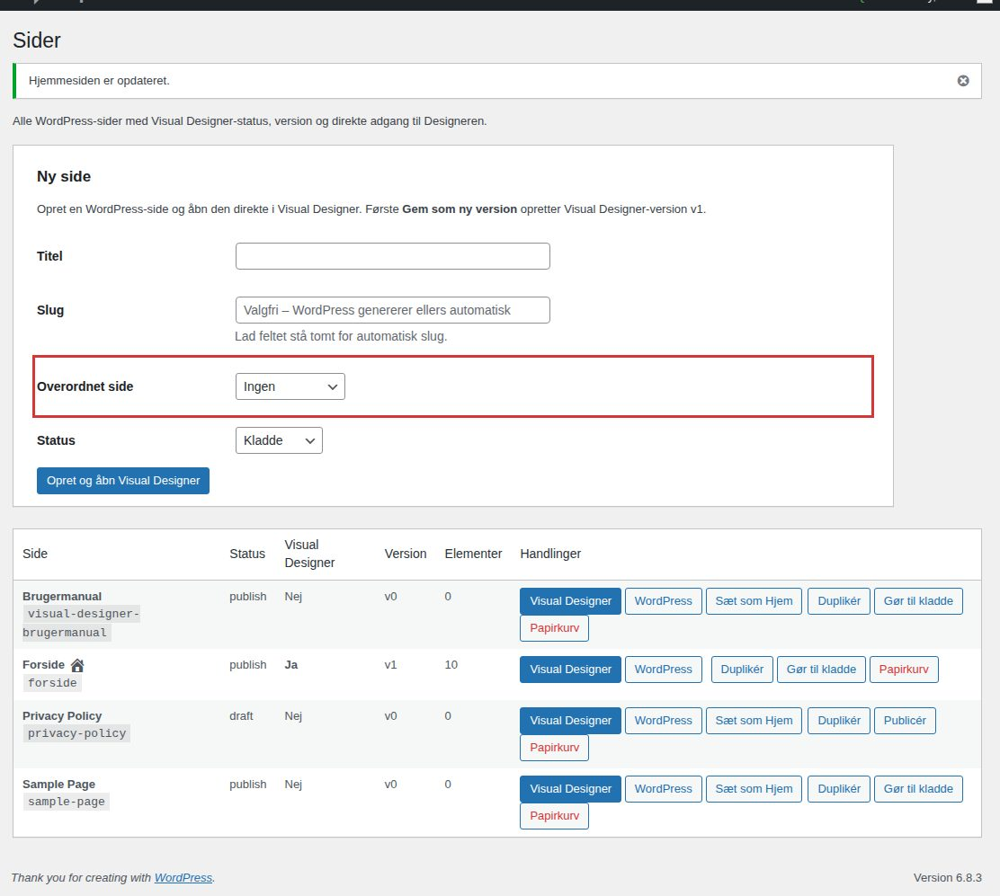

## 5. Visual Designer – grundlæggende

Designeren har tre dele:

| Område | Formål |
|---|---|
| **Elementer** (venstre) | Byggeklodserne: Sektion, Kasse, Tekst, Billede, Knap, Mellemrum, Skillelinje, Events, Køretøjer, Billedgalleri, Navigation, Kontaktformular, Bliv medlem og flere under *V1-elementer*. |
| **Lærredet** (midten) | Siden, som den kommer til at se ud. |
| **Indstillinger** (højre) | Indstillinger for det element, du har valgt. |

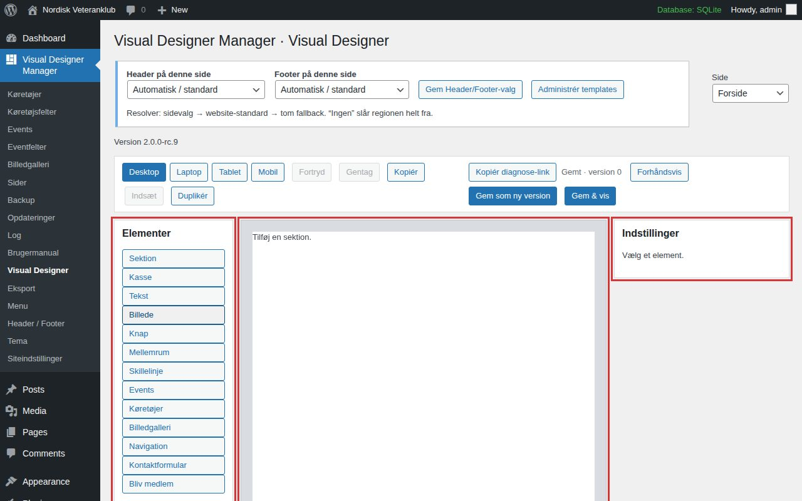

Værktøjslinjen øverst har knapper til **Desktop / Laptop / Tablet / Mobil**, **Fortryd / Gentag** (Ctrl+Z / Ctrl+Y), **Kopiér / Indsæt / Duplikér**, **Forhåndsvis**, **Gem som ny version** (Ctrl+S) og **Gem & vis**.

### Sektioner

En side består af **sektioner**, der ligger under hinanden. Alle andre elementer placeres inde i en sektion.

1. Klik **Sektion** i elementlisten.
2. Vælg en **Baggrund** i Indstillinger. Farvevælgeren har faste farver, dine temafarver, senest brugte farver og et felt til HEX-kode. Klik **Anvend**.

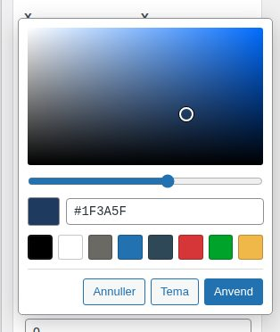

Sektionen tilpasser selv sin højde til indholdet, når **Automatisk højde** er slået til. **Højde** er så den mindste højde.

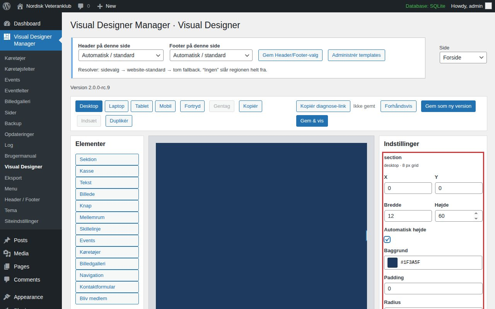

### Tekst

1. Vælg sektionen, og klik **Tekst**. Teksten lægges ind i den valgte sektion, under det der allerede ligger der.
2. Skriv teksten i tekstfeltet under Indstillinger. Knapperne **P / H2 / H3 / B / I / Link** laver afsnit, overskrifter, fed og kursiv tekst og links.
3. Vælg **Tekstfarve**, **Skriftstørrelse**, **Skriftvægt**, **Linjehøjde** og **Justering**. En overskrift (H2) bliver automatisk 1,5 gange skriftstørrelsen.

### Placering og størrelse

Placeringen styres af et gitter:

- **X** og **Bredde** er kolonner. Siden har 12 kolonner, så X = 0 og Bredde = 7 fylder de første 7 af 12 kolonner.
- **Y** og **Højde** er rækker på 8 pixel.

Du kan skrive tallene i felterne. Du kan også trække elementet med musen og trække i håndtagene på kanten for at ændre størrelsen. **Piletasterne** flytter det valgte element ét gittertrin.

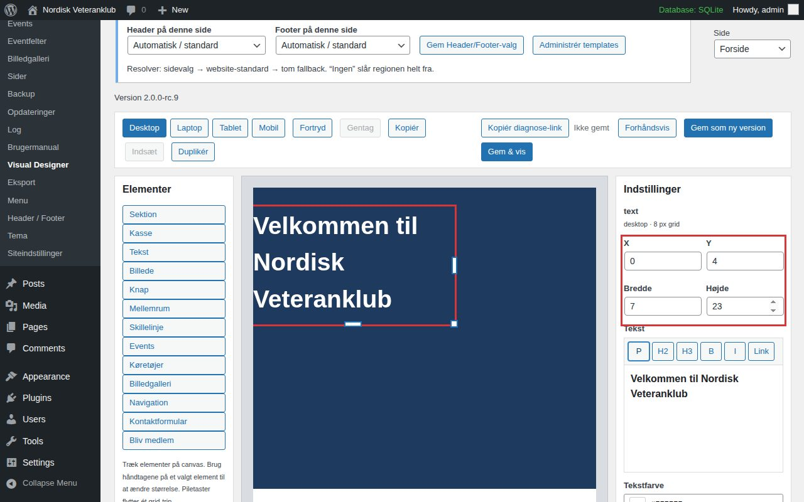

### Knap

Klik **Knap**, og udfyld **Tekst** og **Link**. Linket kan pege på en ekstern adresse, en intern side, et anker (fx `#kontakt`), en e-mail eller et telefonnummer. Du kan også vælge farver, skriftstørrelse, runde hjørner og om linket skal åbne i samme eller nyt vindue.

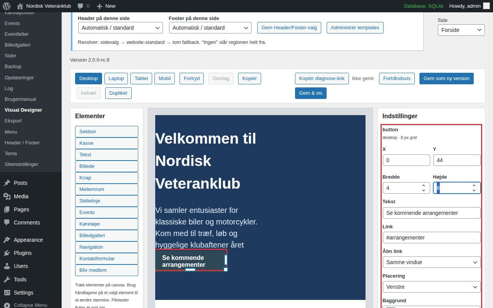

### Billede – og træk-og-slip

Alle elementer kan **trækkes** fra elementlisten direkte ind på lærredet. Slip dem i den sektion eller kasse, hvor de skal ligge.

1. Træk **Billede** ind i sektionen.
2. Klik **Vælg billede** i Indstillinger, og vælg et billede i mediebiblioteket.
3. Vælg **Billedtilpasning**: *Beskær / fyld* fylder feltet helt, og *Tilpas* viser hele billedet. Skriv gerne en **Alt-tekst** til skærmlæsere.

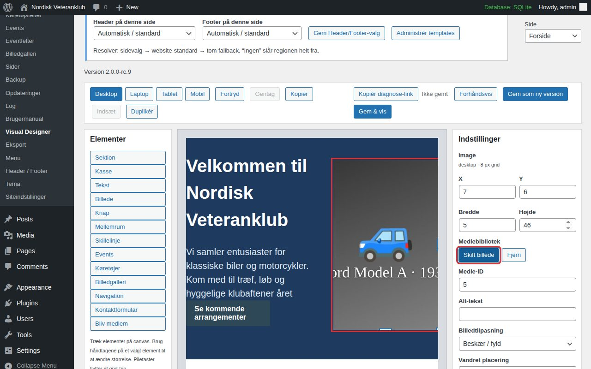

### Resten af siden

Tilføj flere sektioner på samme måde. Klik på det grå område uden for lærredet for at fravælge den aktuelle sektion, og klik så **Sektion** igen. Forsiden i eksemplet har tre sektioner:

1. En velkomst med overskrift, tekst, knap og billede
2. *Kommende arrangementer* med elementet **Events**
3. **Kontaktformular**

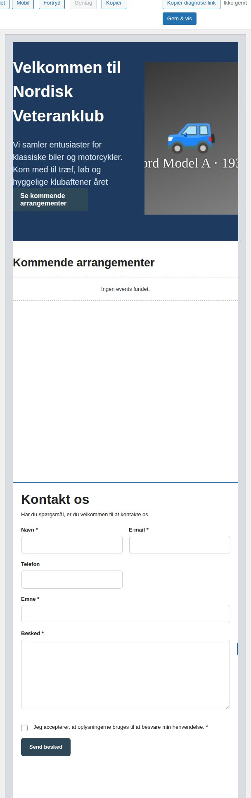

## 6. Tilpas siden til mobil

Hver skærmstørrelse (**Desktop, Laptop, Tablet, Mobil**) kan have sin egen placering af elementerne. Indtil du ændrer noget, bruger de mindre skærme den samme placering som Desktop. Elementer, der står side om side på en computer, bliver derfor ofte for smalle eller overlapper på en telefon.

1. Klik **Mobil** i værktøjslinjen.
2. Vælg hvert element, og giv det **Bredde 12**, så det fylder hele skærmbredden. Sæt **Y**, så elementerne står under hinanden.
3. Gem.

Ændringer i Mobil-visningen påvirker ikke Desktop-visningen.

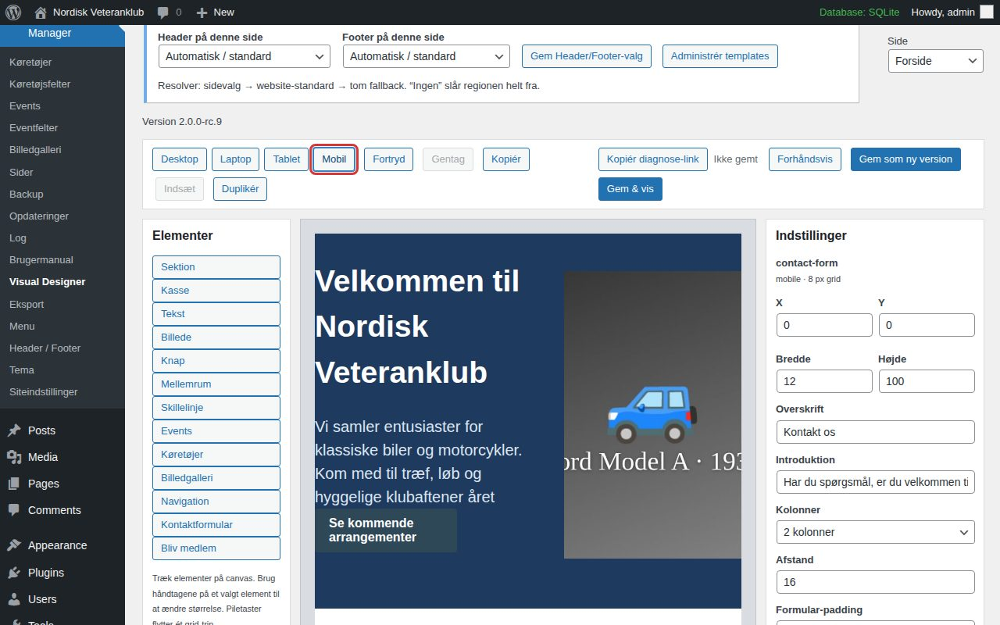

## 7. Gem, forhåndsvis og versioner

- **Gem som ny version** gemmer siden. Hver gemning bliver en ny version, så intet går tabt. Status ved siden af knappen viser *Ikke gemt* eller *Gemt · version N*.
- **Gem & vis** gemmer og åbner den offentlige side.
- **Forhåndsvis** åbner et nyt vindue med de ændringer, du endnu ikke har gemt. Den offentlige side ændres ikke, før du gemmer.

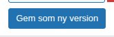

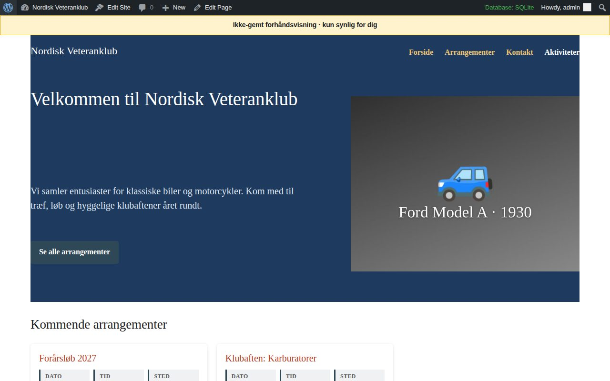

Under Designeren ligger **Gemte versioner**. For hver tidligere version kan du:

- **Forhåndsvis** den.
- **Gendan original** – gemmer den gamle version som en *ny* version. Den nuværende version bliver liggende i historikken, så du kan fortryde gendannelsen.
- **Opret kopi** – laver en ny kladdeside ud fra versionen.

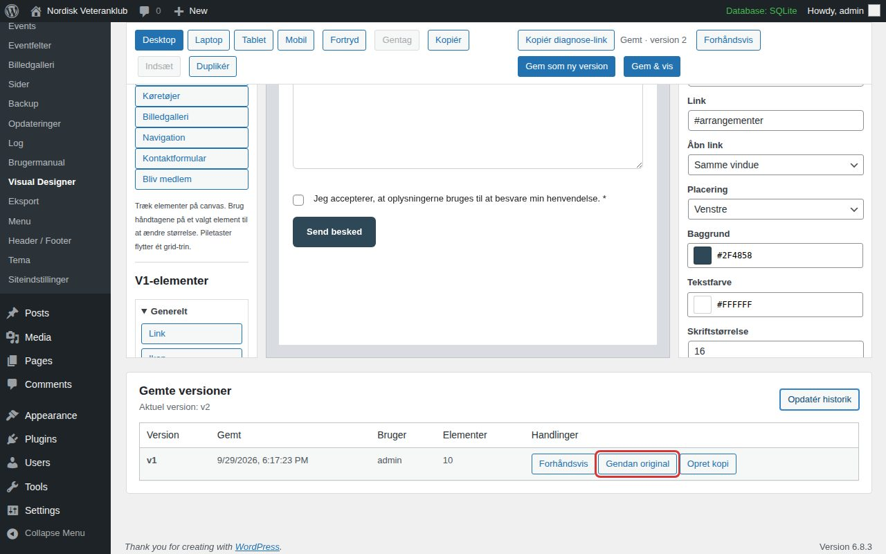

## 8. Menu

Menuen redigeres under **Menu** og gemmes som en almindelig WordPress-menu.

1. Første gang skriver du et navn, fx *Hovedmenu*, og klikker **Opret Hovedmenu**.

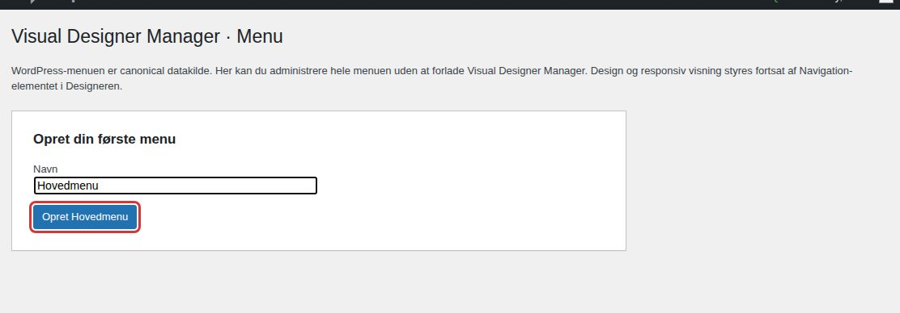

2. Tilføj indhold i højre side:
   - **Publicerede sider**: sæt flueben og klik **Tilføj valgte sider**.
   - **Eksternt link**: menutekst og adresse. Det kan også være et anker som `https://ditdomæne.dk/#kontakt`.
   - **Overskrift**: et menupunkt uden link, fx til en undermenu.
3. Ret **Rækkefølge**, **Tekst** og **Parent** (vælg et andet menupunkt for at lave en undermenu), og klik **Gem menu**.

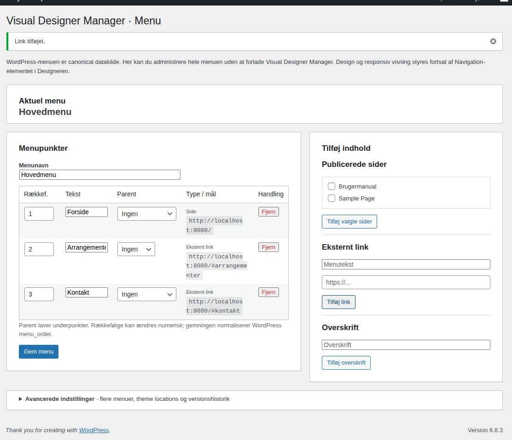

Under *Avancerede indstillinger* kan du oprette flere menuer, tildele theme locations og gendanne en af de sidste 30 gemte menuversioner.

## 9. Header og footer

Header og footer laves i **Header / Footer** med den samme Designer som siderne. Du kan have flere navngivne templates, fx en særlig header til en kampagneside. Den template, der er markeret som *standard*, bruges på alle sider.

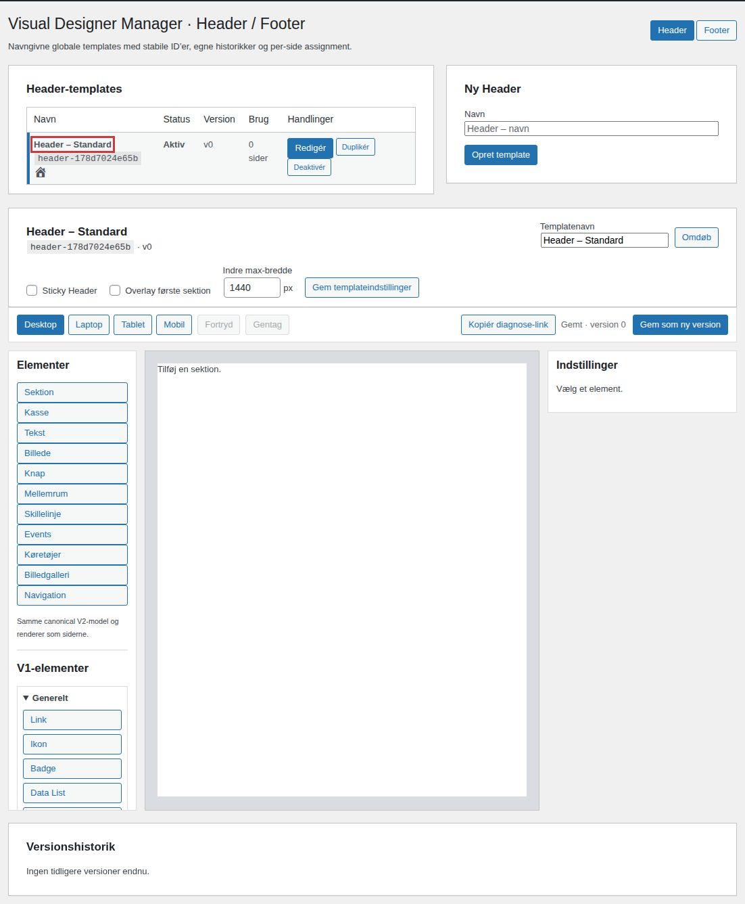

### Header

1. Tilføj en **Sektion** med en baggrundsfarve.
2. Tilføj en **Tekst** med foreningens navn til venstre, eller brug et **Billede** med logoet.
3. Tilføj **Navigation** til højre. Elementet viser automatisk den første menu. Under **WordPress-menu** kan du vælge en anden. Vælg **Justering**, **Tekstfarve** og **Hoverfarve** (farven, når musen er over et menupunkt).
4. Klik **Gem som ny version**.

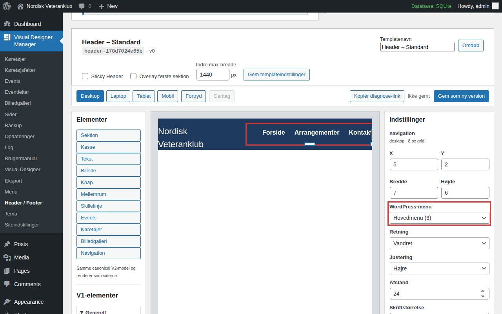

På mobil vises menuen automatisk som en **Menu**-knap. Teksten på knappen ændrer du under *Mobilknap tekst*. Husk også at tilpasse headeren i **Mobil**-visningen (se afsnit 6).

Den åbne mobilmenu vises som et panel oven på siden. Har Navigation-elementet en **Baggrund**, bruger panelet den og elementets tekstfarve. Ellers bruger det **Undermenu-baggrund** og **Undermenu-tekst**, som er hvid med mørk tekst fra start.

### Footer

Skift til **Footer** med knappen øverst til højre, og byg footeren på samme måde, fx med en tekst med kontaktoplysninger.

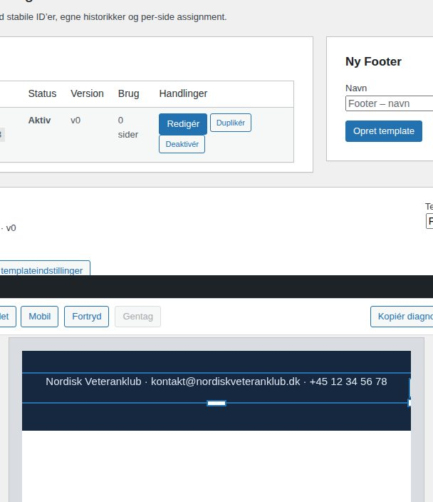

### Header/footer på en enkelt side

Øverst i sidens Designer kan du vælge **Header på denne side** og **Footer på denne side**:

- *Automatisk / standard* bruger standard-templaten.
- Du kan vælge en bestemt template.
- *Ingen* slår headeren eller footeren fra på siden.

Klik **Gem Header/Footer-valg**.

## 10. Events, køretøjer og billedgalleri

### Egne felter

Under **Eventfelter** og **Køretøjsfelter** bestemmer du, hvilke ekstra oplysninger et event eller et køretøj skal have. Klik **+ Tilføj felt**, giv feltet et navn og en type (tekst, tal, dato, ja/nej, …), og vælg om det skal vises på **Kort** (listen) og/eller **Detalje** (egen side). Klik **Gem feltopsætning**.

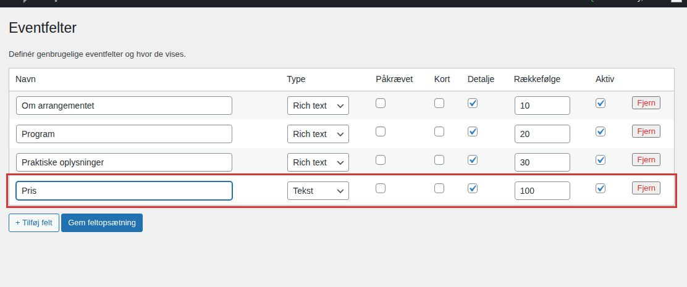

### Opret et event

Gå til **Events → Add New** (Tilføj ny). Skriv titlen øverst. Udfyld dato, tid, sted, adresse, kort beskrivelse og dine egne felter i boksen under teksten. Klik **Publish** (Udgiv).

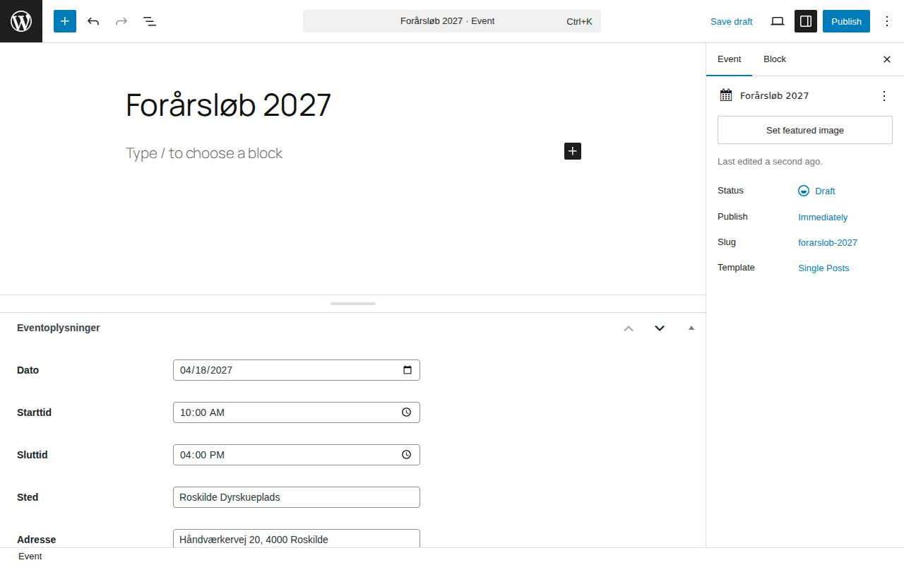

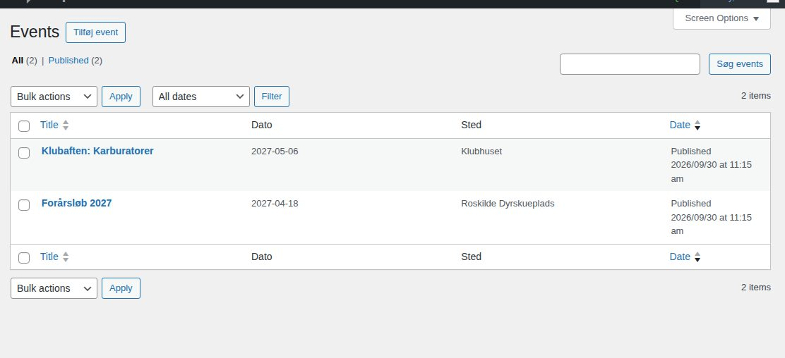

### Opret et køretøj

Gå til **Køretøjer → Add New**, og udfyld producent, model, årgang, land, motor, ydelse, mål og beskrivelse.

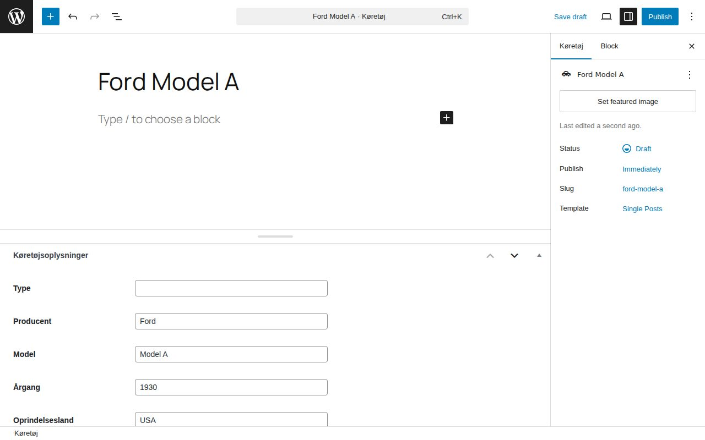

### Opret et album

Gå til **Billedgalleri → Add New**, skriv titel og kort beskrivelse, og klik **Vælg billeder**. Du kan vælge flere billeder ved at holde **Ctrl** (Mac: **Cmd**) nede, mens du klikker. Rækkefølgen ændrer du bagefter ved at trække billederne.

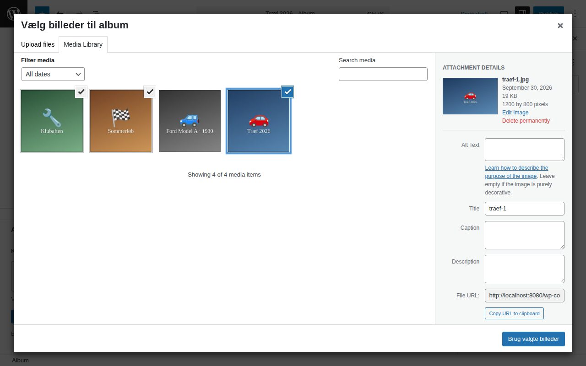

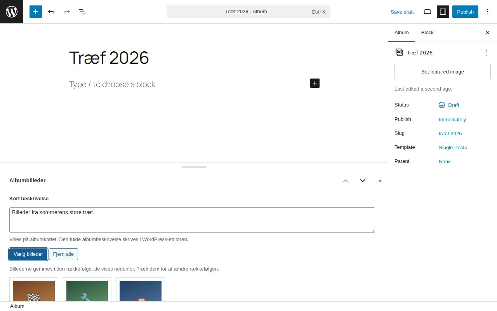

## 11. Vis indholdet på en side

Elementerne **Events**, **Køretøjer** og **Billedgalleri** i Designeren viser automatisk det indhold, du har oprettet. Nye events kommer med af sig selv. I Indstillinger kan du vælge antal kolonner, farver og hvilke oplysninger der vises.

Hvert event, køretøj og album får sin egen detaljeside. Den åbnes med **Læs mere** eller **Åbn album**.

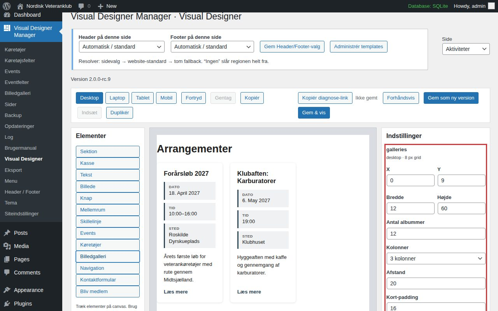

> **Tip:** Modulerne har en fast **Højde** i gitteret. Er der meget tom plads under dem på websitet, gør du Højde mindre.

## 12. Det færdige website

Sådan ser eksemplet ud for en besøgende:

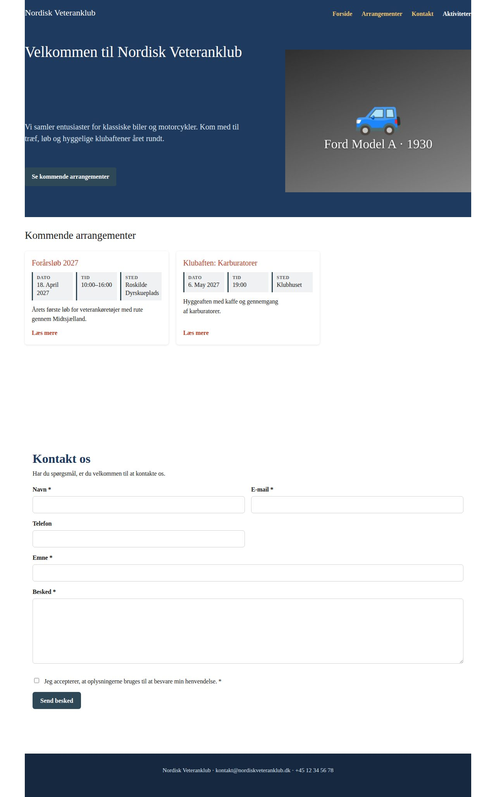

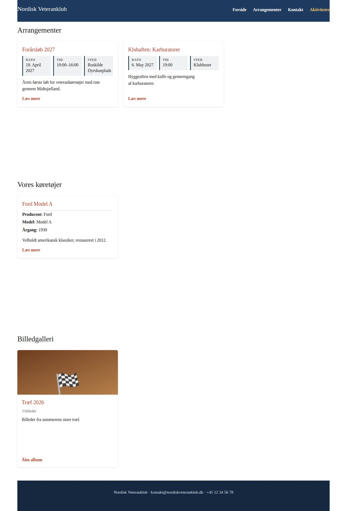

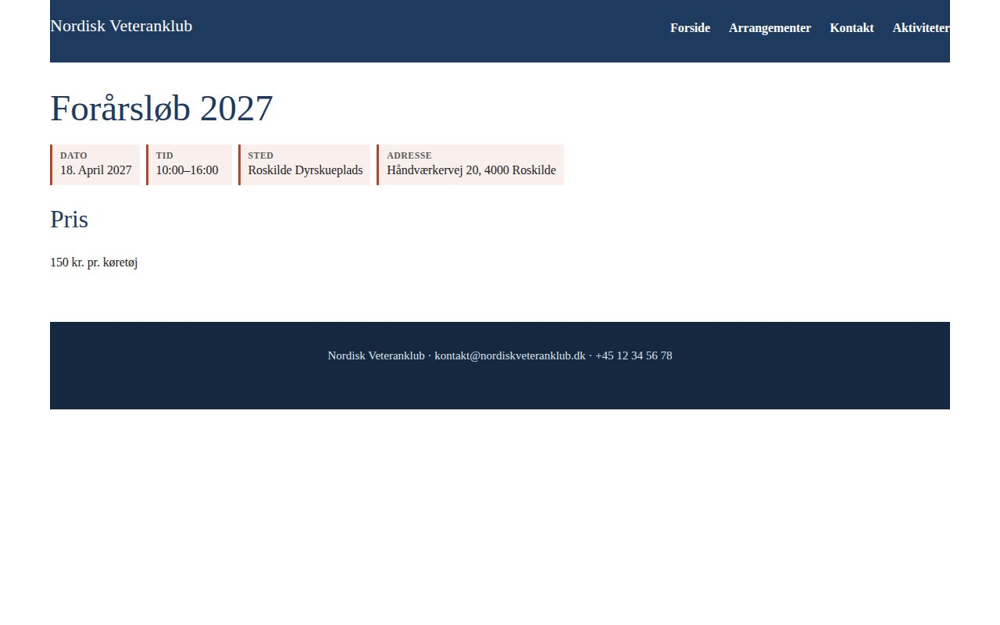

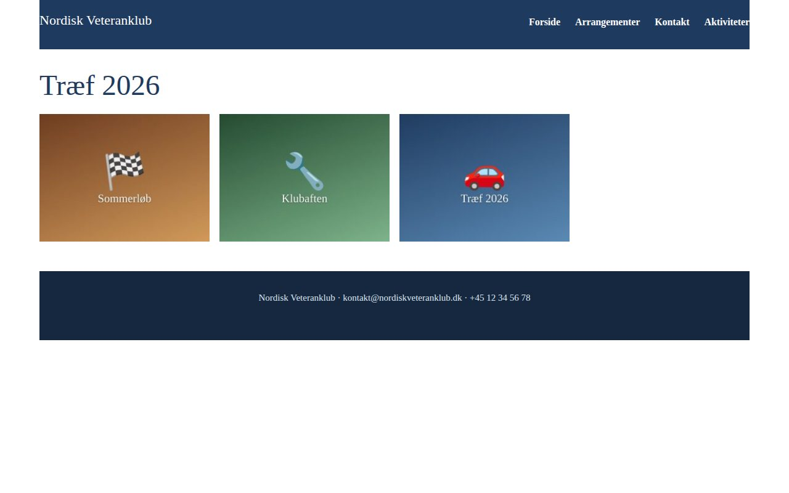

Og på en telefon:

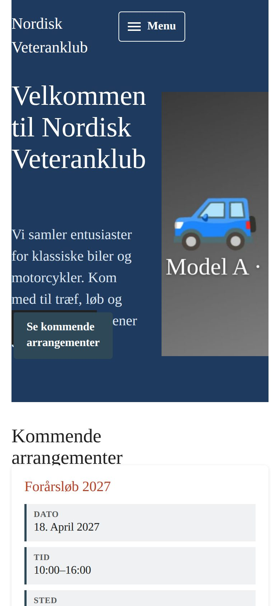
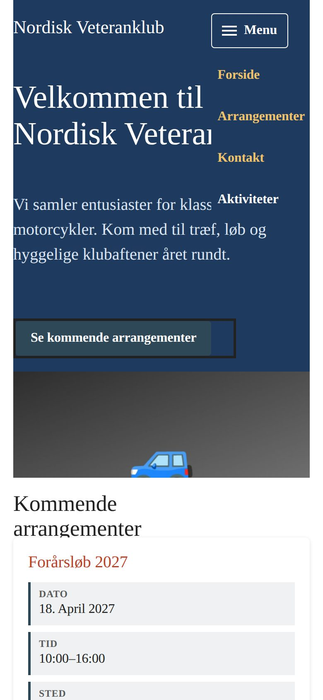

## 13. Kontaktformularen

Elementerne **Kontaktformular** og **Bliv medlem** er færdige formularer. I Indstillinger kan du ændre overskrift, introduktionstekst, antal kolonner, farver og modtager. Hvis modtageren står tom, sendes der til kontakt-e-mailen fra Siteindstillinger. Står den også tom, sendes der til WordPress' administrator-e-mail.

Når en besøgende sender formularen:

- får du en e-mail med navn, e-mail, telefon, emne, besked og hvilken side den kom fra
- får afsenderen en kvittering, med mindre du har slået det fra
- vises *"Tak. Din henvendelse er sendt."* på siden.

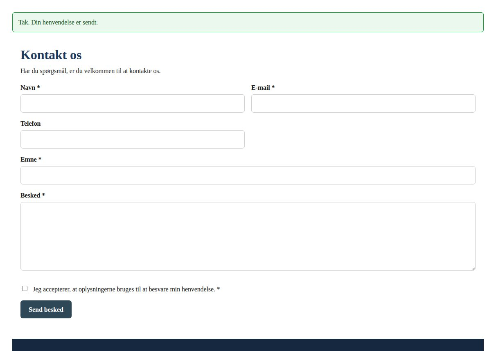

Hvis et obligatorisk felt mangler, beder formularen den besøgende udfylde det. Hvis e-mailen ikke kan sendes på grund af en fejl på serveren, får den besøgende besked om en teknisk fejl, og fejlen skrives i **Log**.

> WordPress skal kunne sende e-mail. På mange webhoteller virker det uden videre. Ellers kan man installere et SMTP-plugin.

## 14. Eksport, import og flytning af site

Under **Eksport** kan du pakke hele VDM-sitet i én ZIP-fil: sider og layouts, header/footer, tema, siteindstillinger, felter, events, køretøjer, albums, menuer og alle brugte billeder. Filen kan bruges som sikkerhedskopi eller til at flytte sitet til en anden WordPress.

**Eksport:** Klik **Opret portable V2 ZIP**, og gem filen.

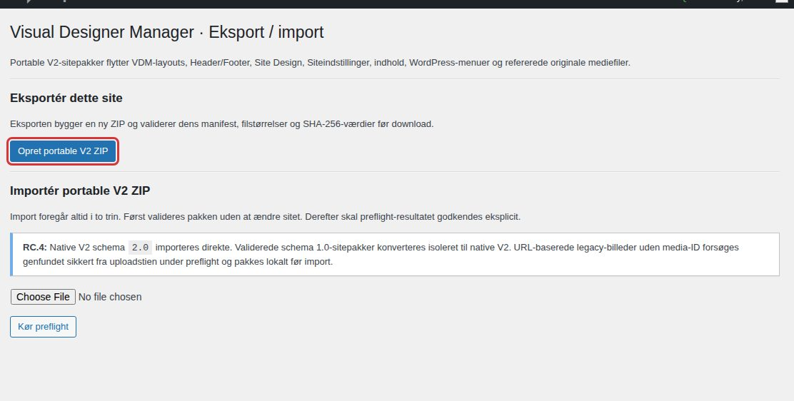

**Import** sker i to trin:

1. Vælg ZIP-filen, og klik **Kør preflight**. Pakken bliver kontrolleret, men der ændres ikke noget endnu. Du ser, hvad pakken indeholder.
2. Klik **Importér den validerede pakke**.

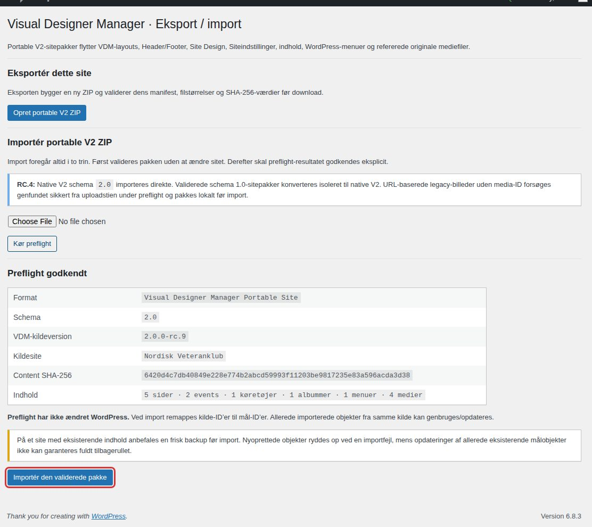

Ved import på et *andet* site oprettes sider, indhold, menuer og billeder på ny, og alle interne henvisninger rettes til det nye site. Hvis du importerer den samme pakke igen, eller gendanner en backup på det site den kom fra, bliver det eksisterende indhold og menuerne opdateret. Der oprettes ingen dubletter.

> Tag en backup af det site, du importerer til, hvis det allerede har indhold.

## 15. Backup, opdateringer og log

**Backup** laver en komplet VDM-backup i samme format som Eksport. Gendannelse sker under Eksport → Import.

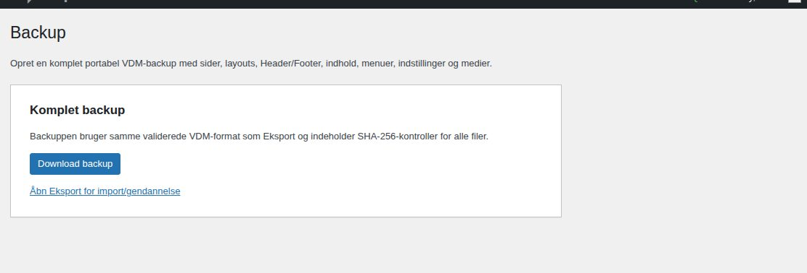

**Opdateringer** viser din version og den nyeste version på GitHub. **Tjek GitHub-opdatering** søger efter en ny version, og **Opdater** installerer den. Før installationen laver VDM automatisk to kontrolpunkter: en kopi af pluginnet og en komplet data-backup. Begge kan hentes igen fra tabellen *Update-checkpoints*.

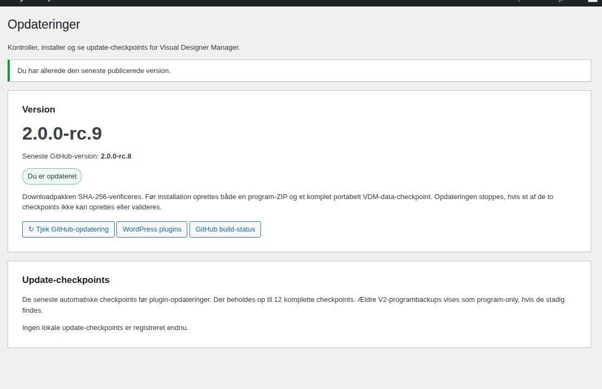

**Log** viser vigtige hændelser, fx sendte formularer, importer og fejl. Kan en side eller formular ikke finde ud af noget, så kig her først. **Kopiér diagnose-link** i Designeren giver et link direkte til loggen for den side, du arbejder på.

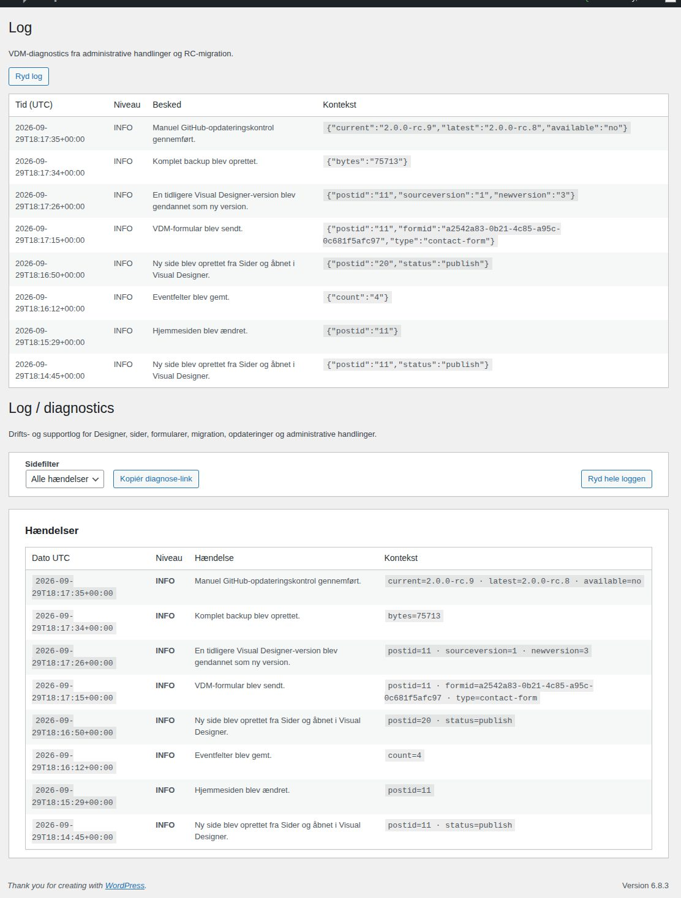

Under **Brugermanual** finder du en kort, indbygget vejledning. Den kan hentes som Word-fil med **Download som Word (.docx)**.

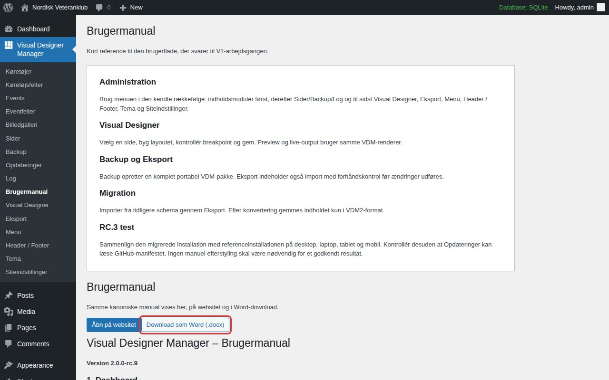

## 16. Gode råd og fejlfinding

**Sikker arbejdsgang**

1. Tag en backup før større ændringer eller en import.
2. Brug **Forhåndsvis**, før du gemmer.
3. Kontrollér **Desktop, Tablet og Mobil**, før du publicerer.
4. En gammel version kan altid gendannes fra *Gemte versioner*.

**Ofte stillede spørgsmål**

| Problem | Løsning |
|---|---|
| Siden vises med WordPress-temaets header i stedet for min egen | Sæt flueben ved **Aktiv** under **Tema** (site-shell). |
| Forsiden viser blogindlæg | Klik **Sæt som Hjem** ud for siden under **Sider**. |
| Menuen i headeren er tom | Vælg en menu under **WordPress-menu** i Navigation-elementets indstillinger, og tjek at menuen har punkter under **Menu**. |
| Elementer overlapper på mobil | Klik **Mobil** i Designeren, og placér elementerne under hinanden med Bredde 12. |
| Stor tom plads under events/køretøjer | Gør modulets **Højde** mindre. |
| Mobilmenuens farver passer ikke til headeren | Ret **Undermenu-baggrund** og **Undermenu-tekst**, eller giv Navigation-elementet en **Baggrund**. |
| Formularen siger "teknisk fejl" | WordPress kan ikke sende e-mail. Se **Log**, og få e-mail sat op på webhotellet, fx med et SMTP-plugin. |
| Jeg kom til at ændre noget forkert | **Fortryd** (Ctrl+Z) før du gemmer, eller **Gendan original** under *Gemte versioner*. |
